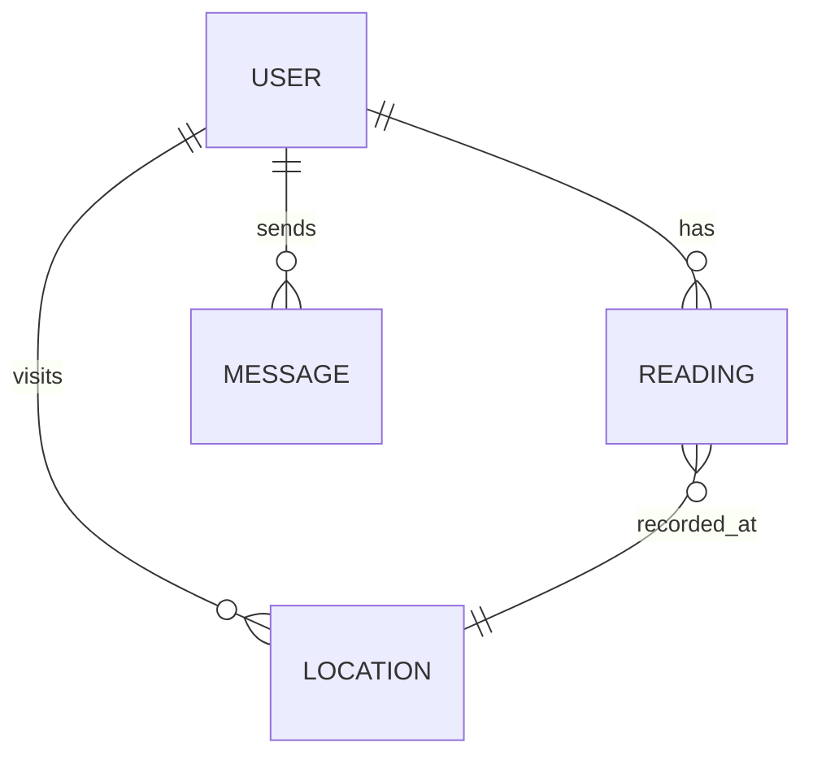

# Chapter 4: Design, Implementation, and Testing

## Overview
The HCE (Health Companion for Elder People) project is a comprehensive health monitoring system designed to assist elderly individuals in tracking vital health metrics such as heart rate and SpO2, while enabling seamless communication with caregivers and healthcare professionals. This chapter details the software development approach, design decisions, implementation, and testing strategies employed throughout the project lifecycle.

## Software Development Approach

### Used Approach
The project adopted the **Agile Software Development** methodology, specifically leveraging the Scrum framework. Agile was chosen for its iterative nature, flexibility, and ability to accommodate evolving requirements, which is crucial in healthcare-related applications where user feedback and regulatory compliance are paramount.

### Justification of the Approach Used
Agile allows for continuous integration of user feedback, rapid prototyping, and incremental delivery of features. This approach ensured that the HCE app could adapt to the needs of elderly users, caregivers, and healthcare professionals, resulting in a user-centric and robust solution.

### Phases of the Chosen Model Approach
1. **Requirement Gathering & Analysis**: Engaged stakeholders (elderly users, caregivers, doctors) to define core features.
2. **Design**: Created wireframes, UML diagrams, and database schemas.
3. **Implementation**: Developed the backend (Node.js, Express, MongoDB), frontend (Flutter), and sensor integration (ESP8266 with MAX30105 sensor).
4. **Testing**: Conducted unit, integration, system, and acceptance testing.
5. **Deployment & Feedback**: Released MVP for pilot testing and collected feedback for further iterations.

### Why is it Better Than Other Approaches?
Compared to the Waterfall model, Agile provides greater flexibility and responsiveness to change. Unlike V-Model or Spiral, Agile's focus on collaboration and iterative delivery aligns well with the dynamic requirements of healthcare applications.

### Alternative Approach
A possible alternative would have been the **Waterfall Model**, which offers a linear and structured process. However, its rigidity and lack of iterative feedback make it less suitable for projects where requirements may evolve.

### Software Modeling Tools Used
- **UML Diagrams**: For system architecture and data flow.
- **Mermaid Diagrams**: For visualizing workflows and relationships (see below).
- **Wireframing Tools**: For UI/UX design.

#### Example: System Architecture (Mermaid)
```mermaid
graph TD
  A[User (Elderly)] -->|Mobile App| B[Flutter Frontend]
  B -->|API Calls| C[Node.js Backend]
  C -->|Sensor Data| D[ESP8266 + MAX30105]
  C -->|Database Ops| E[MongoDB]
  C -->|Notifications| F[Caregiver/Doctor]
```

## Specifications That Distinguish This Software from Other Software
- **Real-time Health Monitoring**: Integration with ESP8266 and MAX30105 for live heart rate and SpO2 readings.
- **Role-based Access**: Separate interfaces and permissions for patients, companions, and doctors.
- **Location-based Services**: Nearby healthcare facilities and pharmacies.
- **Secure Messaging**: Encrypted communication between users and healthcare providers.
- **User-friendly Interface**: Designed for elderly users with accessibility in mind.

## Implementation

### User Interface
The UI was developed using Flutter, ensuring cross-platform compatibility and a responsive design. The interface prioritizes large buttons, clear fonts, and intuitive navigation for elderly users.

**[PLACEHOLDER: Insert screenshots of the login, home, and monitoring screens here]**

### Code
The project is divided into three main components:
- **Frontend (Flutter)**: Handles user interaction and visualization.
- **Backend (Node.js/Express)**: Manages business logic, authentication, and data storage.
- **Sensor Firmware (ESP8266/Arduino)**: Reads sensor data and communicates with the backend.

#### Example: Backend Reading Model (Node.js)
```javascript:d:\.work\.TRAE\HCE\HCE_APP\hce-backend\models\reading.js
const mongoose = require('mongoose');

const readingSchema = new mongoose.Schema({
  userId: {
    type: mongoose.Schema.Types.ObjectId,
    ref: 'User',
    required: true,
  },
  heartRate: {
    type: Number,
    required: true,
  },
  spo2: {
    type: Number,
    required: true,
  },
  timestamp: {
    type: Date,
    default: Date.now,
  },
  location: {
    latitude: { type: Number },
    longitude: { type: Number },
  },
});

module.exports = mongoose.model('Reading', readingSchema);
```

#### Example: Sensor Simulation (Python)
```python:d:\.work\.TRAE\HCE\HCE_APP\hce-backend\test\esp_sensor_simulation.py
# Simulates heart rate and SpO2 readings for testing
@app.route('/readings')
def get_readings():
    # ... existing code ...
    return jsonify({
        "status": "success",
        "heartRate": round(calculated_bpm, 1),
        "spo2": round(displayed_spo2, 1),
        "beatsDetected": beat_count,
        "timestamp": time.strftime("%Y-%m-%dT%H:%M:%S.000Z", time.gmtime())
    })
```

### Database
MongoDB was chosen for its flexibility and scalability. Collections include users, readings, messages, and locations. The schema supports role-based access and geospatial queries for location-based services.

#### Example: Database Entity Relationship (Mermaid)


## Issues and Problems Faced in the Project
- **Sensor Integration**: Challenges in stable communication between ESP8266 and backend.
- **Data Accuracy**: Ensuring reliable heart rate and SpO2 readings.
- **User Authentication**: Implementing secure, role-based access.
- **UI Accessibility**: Designing for elderly users with varying levels of tech literacy.
- **Testing Hardware**: Simulating sensor data for backend testing.

## Testing

### White Box Testing
- Conducted unit tests on backend logic and sensor data processing.
- Verified API endpoints using automated scripts.

### Black Box Testing
- Performed user acceptance testing with real users.
- Tested app flows without knowledge of internal code.

### Unit Testing
- Backend: Used Mocha/Chai for API and logic tests.
- Sensor: Simulated readings to validate data processing.

### System Testing
- End-to-end tests covering user registration, login, data submission, and messaging.

### Acceptance Testing
- Piloted with a group of elderly users and caregivers.
- Collected feedback and iterated on usability.

### Validation and Verification
- Verified that all requirements were met.
- Validated with stakeholders through demos and feedback sessions.

## Summary of the Chapter
This chapter outlined the design, implementation, and testing of the HCE system, highlighting the Agile approach, technical challenges, and robust testing strategies that ensured a reliable and user-friendly solution.

---

# Chapter 5: Results and Discussion

## Overview About This Chapter
This chapter presents the outcomes of the HCE project, discusses the critical findings, and reflects on the skills and knowledge gained during development.

## Critical Discussion
The HCE system successfully integrates hardware, software, and user experience to address the unique needs of elderly users. Real-time health monitoring, secure communication, and location-based services distinguish the app from existing solutions. However, challenges such as sensor calibration and user onboarding required iterative improvements.

## Skills Acquired from the Project
- Full-stack development (Flutter, Node.js, MongoDB)
- IoT integration (ESP8266, MAX30105)
- Agile project management
- UI/UX design for accessibility
- Automated testing and CI/CD

## Development Goals and Results
- **Goal**: Provide real-time health monitoring for elderly users.
  - **Result**: Achieved through seamless sensor integration and live data visualization.
- **Goal**: Enable secure communication between users and caregivers.
  - **Result**: Implemented encrypted messaging and role-based access.
- **Goal**: Offer location-based healthcare services.
  - **Result**: Integrated geolocation and nearby facility search.

## Findings and Results
- The system is robust, scalable, and user-friendly.
- Real-world testing demonstrated reliable data collection and communication.
- User feedback highlighted the importance of accessibility and simplicity.

## Project Goals
- Enhance elderly independence and safety.
- Facilitate proactive healthcare management.
- Bridge the gap between patients, companions, and healthcare providers.

## Future Work
- **Integration with Wearables**: Support for additional health sensors (e.g., blood pressure, glucose monitors).
- **AI-based Health Analytics**: Predictive analytics for early detection of health anomalies.
- **Telemedicine Features**: Video consultations and remote prescriptions.
- **Multi-language Support**: Broader accessibility for non-English speakers.

## New Area of Investigation
- **Machine Learning for Health Trends**: Leveraging collected data to identify health patterns and provide personalized recommendations.
- **Blockchain for Medical Records**: Ensuring data integrity and privacy.

## Features Not Complete Due to Time Constraints
- Real-time push notifications for abnormal readings.
- Advanced analytics dashboard for caregivers/doctors.
- Integration with national health databases.

## Summary of the Chapter
The HCE project achieved its primary objectives, delivering a functional and impactful solution. The experience provided valuable technical and project management skills, with clear pathways for future enhancements.

---

# Chapter 6: Conclusion

## Conclusion
The HCE: Health Companion App for Elder People demonstrates the power of technology in improving the quality of life for elderly individuals. By combining IoT, mobile development, and user-centric design, the project delivers a comprehensive health monitoring and communication platform. The iterative Agile approach ensured adaptability and responsiveness to user needs, resulting in a solution that is both practical and scalable. Future work will focus on expanding features, enhancing analytics, and broadening accessibility to maximize the app's impact.

---

**[PLACEHOLDER: Insert summary screenshots, user feedback, and additional diagrams as needed throughout the document]**

---